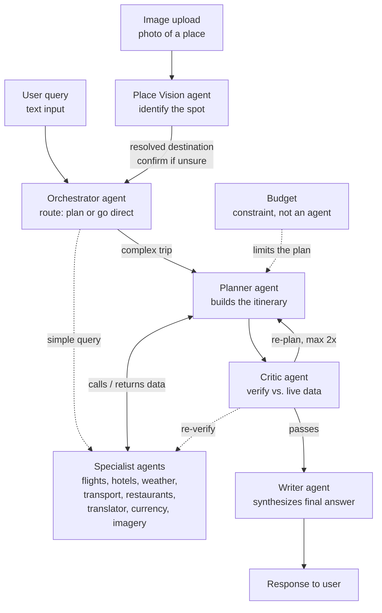

# Wanderly — Your Multi-Agent Travel Planner

> Wanderly turns a single request, like "plan me a trip to this country within this budget," into a complete, verified itinerary using a team of specialized agents working together. An orchestrator routes each request, a planner builds the trip with help from expert agents, a critic checks the work and sends it back for fixes until it holds up, and a writer delivers the final plan. The result is a travel companion that doesn't just suggest ideas, it plans, verifies, and self-corrects before it ever reaches you.

This README is both the **project documentation** and a **step-by-step build guide**. The repo starts empty. Each phase below is written so you can paste it into Claude Code (or build it yourself) one piece at a time, and the whole thing deploys to Vercel at the end.

---

## Table of contents

1. [What you are building](#what-you-are-building)
2. [Architecture](#architecture)
3. [Tech stack](#tech-stack)
4. [Repo structure](#repo-structure)
5. [Prerequisites and API keys](#prerequisites-and-api-keys)
6. [Environment variables](#environment-variables)
7. [Model configuration](#model-configuration)
8. [Build it step by step](#build-it-step-by-step)
9. [Agent specifications](#agent-specifications)
10. [How the orchestration works](#how-the-orchestration-works)
11. [The critic loop](#the-critic-loop)
12. [The UI / UX](#the-ui--ux)
13. [Run it locally](#run-it-locally)
14. [Deploy to Vercel](#deploy-to-vercel)
15. [Demo script for judges](#demo-script-for-judges)
16. [Troubleshooting](#troubleshooting)
17. [Roadmap](#roadmap)

---

## What you are building

Wanderly is a single-page web app. A user types a travel request, or even just uploads a photo of a place they saw online, and behind the scenes a network of AI agents collaborates to produce a verified, budget-aware itinerary, with the UI showing the agents working in real time. The agents are:

- **Orchestrator** — reads the request and decides whether to run the full planning pipeline or route a simple question straight to one specialist.
- **Planner** — assembles the trip, calling specialist agents for the data it needs.
- **Specialists** — narrow experts that each own one data source (flights, hotels, weather, transport, restaurants, translation, currency, imagery).
- **Place Vision** — given an uploaded photo, identifies the location (landmark, city, country) so a user can plan a trip just from an image. Returns a confidence level and alternate guesses, and the app asks the user to confirm a low-confidence guess before planning.
- **Critic** — checks the plan against the live data and the budget, and sends it back to the planner to fix if something does not hold up (capped at 2 retries).
- **Writer** — turns the verified plan into a clear, friendly itinerary for the user.

Budget is **not** an agent. It is a constraint that the planner optimizes against and the critic enforces.

---

## Architecture



**Flow in words:** the user query enters the orchestrator. If the user uploaded a photo instead of (or alongside) text, the Place Vision agent runs first to identify the location and fill in the destination; if it isn't confident, the app surfaces its best guess for the user to confirm before anything else happens. For a real trip, the orchestrator hands off to the planner, which calls whichever specialist agents it needs (often in parallel) to gather flights, lodging, weather, and so on, all under the budget constraint. The planner's draft goes to the critic, which re-checks the facts against the same data sources and verifies the budget math. If the plan fails, the critic returns it to the planner with notes and the planner revises (up to 2 times). Once it passes, the writer formats the final itinerary and returns it to the user. Simple one-off questions ("what's the weather in Doha?") skip the planner and go straight to the relevant specialist.

---

## Tech stack

| Layer | Choice | Why |
|---|---|---|
| Framework | **Next.js 15 (App Router)** | One project holds the UI and all agent logic; deploys to Vercel with zero config. |
| Language | **TypeScript** | Type-safe agent contracts catch bugs before the demo does. |
| AI | **OpenAI Node SDK** (`openai`) | Each agent is a chat completion with its own system prompt; the planner uses tool calling to invoke specialists. |
| Styling | **Tailwind CSS** | Fast, clean UI for the showcase. |
| Validation | **Zod** | Validate agent JSON output so a bad response never crashes the pipeline. |
| Hosting | **Vercel** | Native Next.js host; serverless functions run the orchestration. |

Everything runs server-side in Next.js **route handlers** (serverless functions). Your OpenAI key and all third-party keys stay on the server and are never exposed to the browser.

---

## Repo structure

```
wanderly/
├── app/
│   ├── api/
│   │   └── plan/
│   │       └── route.ts          # Main orchestration endpoint (streams agent events)
│   ├── globals.css
│   ├── layout.tsx
│   └── page.tsx                  # Main single-page UI
├── components/
│   ├── ChatInput.tsx             # Query box + budget input
│   ├── AgentActivity.tsx         # Live panel: lights up each agent as it runs
│   ├── ItineraryView.tsx         # Renders the final plan as cards
│   ├── BudgetMeter.tsx           # Shows spend vs. budget
│   └── CriticBadge.tsx           # "verified" / "re-planned 1x" indicator
├── lib/
│   ├── openai.ts                 # OpenAI client + MODELS config
│   ├── types.ts                  # TripRequest, Itinerary, AgentEvent, etc.
│   ├── orchestrator.ts           # Routing + pipeline driver
│   ├── tools.ts                  # Tool/function schemas the planner can call
│   └── agents/
│       ├── planner.ts
│       ├── critic.ts
│       ├── writer.ts
│       └── specialists/
│           ├── flights.ts
│           ├── hotels.ts
│           ├── weather.ts
│           ├── transport.ts
│           ├── restaurants.ts
│           ├── translator.ts
│           ├── currency.ts
│           ├── images.ts
│           └── placevision.ts     # identifies a location from an uploaded photo
├── .env.example
├── .env.local                    # Your real keys (gitignored)
├── next.config.ts
├── package.json
├── tailwind.config.ts
├── tsconfig.json
└── README.md
```

---

## Prerequisites and API keys

Install first:

- **Node.js 20+** and npm
- A **Vercel account** (free) and the Vercel CLI: `npm i -g vercel`
- An **OpenAI API key** with billing enabled

> **Quick check**: in-app, open the **API status** pill in the top-right corner of any page. Green = wired up, gray = mocked. The same info, formatted for the moment you need it.

Specialist data APIs. The free / no-signup ones are marked so you can prioritize them under time pressure:

| Agent | Recommended API | Cost | Signup needed |
|---|---|---|---|
| Weather | [Open-Meteo](https://open-meteo.com/) | Free | **No key needed** |
| Currency | [exchangerate.host](https://exchangerate.host/) or [Frankfurter](https://frankfurter.dev/) | Free | **No key needed** |
| Translator | OpenAI itself (no separate API) | — | No |
| Images | [Unsplash API](https://unsplash.com/developers) | Free tier | Yes (instant) |
| Restaurants / places | [Google Places API](https://developers.google.com/maps/documentation/places/web-service) or [Yelp Fusion](https://docs.developer.yelp.com/) | Free tier | Yes |
| Flights | [Amadeus Self-Service (sandbox)](https://developers.amadeus.com/) | Free tier | Yes |
| Hotels | Amadeus Self-Service (same account) | Free tier | Yes |

**Time-saver:** every specialist also ships with a **mock fallback** (see Phase 2). If a key is missing or an API rate-limits during the demo, the agent returns realistic mock data instead of crashing. Build the no-key APIs (weather, currency, translator) first so you have a working pipeline within the first hour, then layer in the keyed ones.

---

## Environment variables

Create `.env.example` (committed) and `.env.local` (gitignored, your real values):

```bash
# Required
OPENAI_API_KEY=sk-...

# Specialist APIs (optional — agents fall back to mock data if absent)
UNSPLASH_ACCESS_KEY=
GOOGLE_PLACES_API_KEY=
AMADEUS_CLIENT_ID=
AMADEUS_CLIENT_SECRET=

# No key required for these, listed for clarity:
# Weather  -> Open-Meteo
# Currency -> exchangerate.host
```

Add the same variable **names** in the Vercel dashboard later (Settings → Environment Variables). Never commit `.env.local`.

---

## Model configuration

All model choices live in one file so you can tune cost vs. quality in one place. Current OpenAI models (verified May 2026 — confirm the latest on [platform.openai.com/docs/models](https://platform.openai.com/docs/models)):

`lib/openai.ts`

```ts
import OpenAI from "openai";

export const client = new OpenAI({ apiKey: process.env.OPENAI_API_KEY });

// Cheap + fast for high-volume simple agents; stronger model for reasoning.
export const MODELS = {
  orchestrator: "gpt-5.4-mini", // routing/classification — simple, runs every request
  specialist:   "gpt-5.4-mini", // mostly call an API + format the result
  placeVision:  "gpt-5.4",      // VISION: identify a location from an uploaded photo — must be a multimodal model
  planner:      "gpt-5.4",      // real reasoning: assemble a coherent trip
  critic:       "gpt-5.4",      // judgment: catch errors and budget breaks
  writer:       "gpt-5.4",      // synthesis: clean final write-up
} as const;

// Different agents can use different models — that is the point of this config.
// The Place Vision agent specifically needs a multimodal (vision-capable) model;
// text-only agents do not. Confirm a model supports image input before assigning it.
// Want maximum quality on the hard parts? Bump planner + critic to "gpt-5.5".
// Want the cheapest possible run? Set the text agents to "gpt-5.4-mini" or "gpt-5.4-nano".
```

> Note on the API surface: this guide uses the **Chat Completions API** (`client.chat.completions.create`) because it is the most stable and best documented for tool calling. OpenAI's newer **Responses API** (`client.responses.create`) also works; if you prefer it, the agent logic is identical, only the call shape changes.

---

## Build it step by step

Paste each phase into Claude Code as a prompt, or build by hand. Phases are ordered so you have a working end-to-end pipeline as early as possible, then add richness.

### Phase 0 — Scaffold the project

```bash
npx create-next-app@latest wanderly --typescript --tailwind --app --eslint --src-dir=false
cd wanderly
npm install openai zod
mkdir -p lib/agents/specialists components app/api/plan
```

Create `.env.example` and `.env.local` from the section above. Add `lib/openai.ts` with the model config.

### Phase 1 — Shared types and the OpenAI helper

In `lib/types.ts`, define the contracts every agent shares:

```ts
export interface TripRequest {
  raw: string;            // the user's original text
  destination?: string;   // parsed by the orchestrator
  city?: string;
  budgetUSD?: number;
  durationDays?: number;
  travelers?: number;
}

export interface AgentEvent {        // streamed to the UI for the live panel
  agent: string;                     // "orchestrator" | "planner" | "flights" | ...
  status: "started" | "done" | "error";
  detail?: string;
}

export interface Itinerary {
  summary: string;
  days: Array<{ day: number; items: string[] }>;
  estimatedCostUSD: number;
  sources: string[];     // which specialists/APIs contributed (for the critic)
}
```

Add a small wrapper that calls a model and (optionally) parses JSON with Zod, so a malformed response is caught and retried rather than crashing.

### Phase 2 — Specialist agents (start with the no-key ones)

Each specialist is a function: take a typed input, call its API (or return mock data), optionally pass the raw result through `MODELS.specialist` to clean/summarize it, and return typed output. Build in this order:

1. `weather.ts` — Open-Meteo, no key.
2. `currency.ts` — exchangerate.host, no key.
3. `translator.ts` — OpenAI call, no extra API.
4. `images.ts` — Unsplash (key) with mock fallback.
5. `restaurants.ts` — Google Places or Yelp (key) with mock fallback.
6. `flights.ts` and `hotels.ts` — Amadeus sandbox (key) with mock fallback.
7. `placevision.ts` — send an uploaded image to `MODELS.placeVision` (a vision-capable model) and return `{ guess, confidence, alternates[] }`: the most likely location plus a confidence score and one or two alternates. No extra API and no extra key — it uses your OpenAI key. **Scope the prompt to identify the place or landmark, never people in the photo.** Reliable on famous landmarks and skylines, weaker on generic scenes, which is why the confidence + confirmation flow matters.

**Mock fallback pattern** — every specialist starts with:

```ts
if (!process.env.SOME_KEY) {
  return mockData; // realistic sample so the demo never breaks
}
```

### Phase 3 — Planner agent

`lib/agents/planner.ts` takes a `TripRequest` and produces a draft `Itinerary`. It uses **tool calling**: you give it the specialist functions as tools (defined in `lib/tools.ts`), it decides which to call, you execute them (in parallel with `Promise.all` where possible), feed results back, and it returns structured JSON. Its system prompt tells it to respect the budget and to record which sources it used.

### Phase 4 — Orchestrator and routing

`lib/orchestrator.ts` is the pipeline driver. If the request includes an **uploaded image**, it first calls the Place Vision agent to identify the location and set `TripRequest.destination`; if the confidence is low or there are competing alternates, it pauses and returns the guess to the UI for the user to confirm before continuing. Then (or for text-only requests) it calls `MODELS.orchestrator` to parse the query into a `TripRequest` and classify it as `plan` or `direct`. For `plan`, it runs Planner → Critic → Writer. For `direct`, it calls the one relevant specialist and a short Writer pass. It emits `AgentEvent`s along the way so the UI can show progress.

### Phase 5 — Critic agent and the feedback loop

`lib/agents/critic.ts` receives the draft itinerary plus the source data. It checks: does the estimated cost fit the budget, is every claim backed by a source, are dates/durations consistent. It returns `{ approved: boolean, issues: string[] }`. The orchestrator loops: if not approved and retries remain (max 2), it sends the issues back to the planner to revise. See [The critic loop](#the-critic-loop).

### Phase 6 — Writer agent

`lib/agents/writer.ts` takes the approved itinerary and produces the final user-facing plan. It returns two things: (1) the **structured itinerary** the UI renders as cards (warm summary, day-by-day breakdown, total cost vs. budget, source links), and (2) a short **spoken summary** string (2-3 sentences) for optional read-aloud. The cards are the primary, always-on output. The spoken summary powers an optional "Listen" button (see the UI section) so you never depend on audio working for the core demo.

### Phase 7 — The API route

`app/api/plan/route.ts` is a POST handler that takes `{ query, budget }`, runs the orchestrator, and **streams** `AgentEvent`s and the final itinerary back to the browser (Server-Sent Events or a `ReadableStream`). Set the function timeout high enough for the full pipeline:

```ts
export const maxDuration = 60; // seconds — the multi-agent pipeline needs room
```

### Phase 8 — The UI / UX

Build last, for the showcase. See [The UI / UX](#the-ui--ux). This is what wins the demo, so leave real time for it.

---

## Agent specifications

| Agent | Model | Input | Output | Data source |
|---|---|---|---|---|
| Orchestrator | `gpt-5.4-mini` | Raw query | `TripRequest` + route decision | — |
| Planner | `gpt-5.4` | `TripRequest` | Draft `Itinerary` | Calls specialists via tools |
| Flights | `gpt-5.4-mini` | Origin, dest, dates | Flight options + price | Amadeus / mock |
| Hotels | `gpt-5.4-mini` | City, dates, budget | Lodging options + price | Amadeus / mock |
| Weather | `gpt-5.4-mini` | City, dates | Forecast summary | Open-Meteo |
| Transport | `gpt-5.4-mini` | City | Local transit summary | Places / mock |
| Restaurants | `gpt-5.4-mini` | City, preferences | Restaurant picks | Places / Yelp / mock |
| Translator | `gpt-5.4-mini` | Phrases, target lang | Translations | OpenAI |
| Currency | `gpt-5.4-mini` | Amount, from, to | Converted amount | exchangerate.host |
| Images | `gpt-5.4-mini` | Place name | Image URLs | Unsplash / mock |
| Place Vision | `gpt-5.4` (vision) | Uploaded image | Location guess + confidence + alternates | OpenAI vision |
| Critic | `gpt-5.4` | Draft + sources + budget | `{approved, issues[]}` | Re-checks specialists |
| Writer | `gpt-5.4` | Approved itinerary | Final user-facing plan | — |

Each agent's behavior is defined entirely by its **system prompt**. Keep prompts short and specific: state the agent's single job, the exact output format (JSON shape), and the one rule that matters most (e.g. the critic: "reject any plan whose estimated cost exceeds the budget, and any claim with no source").

---

## How the orchestration works

```
POST /api/plan { query, budget }
        │
        ▼
  Orchestrator  ──parse──►  TripRequest { destination, budget, days, ... }
        │
        ├── route = "direct"  ──►  one Specialist  ──►  short Writer  ──►  done
        │
        └── route = "plan"
                 │
                 ▼
            Planner  ──tool calls──►  [Flights, Hotels, Weather, ...] (parallel)
                 │  draft Itinerary
                 ▼
             Critic  ──►  approved?
                 │           │
              no │           │ yes
        (retries left)       ▼
                 │        Writer  ──►  final itinerary  ──►  done
                 ▼
         back to Planner (with issues)
```

The orchestrator owns the control flow. Specialists never call each other; they only return data to the planner. Run independent specialist calls concurrently with `Promise.all` to keep the whole request well under the function timeout.

---

## The critic loop

This is the part that makes the system feel intelligent, so make it visible in the UI.

```ts
let draft = await planner(tripRequest);
let result = await critic(draft);
let attempts = 0;

while (!result.approved && attempts < 2) {
  attempts++;
  draft = await planner(tripRequest, result.issues); // revise with feedback
  result = await critic(draft);
}

const finalPlan = await writer(draft);
// Tell the UI: verified on first pass, or re-planned N times.
```

The critic checks against the **same sources** the planner used (re-verify prices and availability) and enforces the **budget constraint**. Capping at 2 retries keeps latency predictable for the demo while still showing genuine self-correction.

---

## The UI / UX

Single page, three regions, built with Tailwind:

1. **Chat input** (`ChatInput.tsx`) — a text box for the request, a budget field, an **image upload** button ("plan from a photo"), and a "Plan my trip" button. When a photo is uploaded, show a small preview. If the Place Vision agent isn't confident, show its best guess and alternates as tappable chips ("Is this Boston, Charles River? · or Cambridge · or somewhere else") and only continue once the user confirms.
2. **Agent activity panel** (`AgentActivity.tsx`) — the showpiece. As `AgentEvent`s stream in, each agent appears and lights up: orchestrator → planner → specialists firing (ideally in parallel) → critic → writer. Show the critic loop explicitly ("Critic found 2 issues, re-planning..."). This makes the multi-agent system *visible*, which is what judges remember.
3. **Itinerary view** (`ItineraryView.tsx`) — the final plan as clean day-by-day cards, with a **budget meter** (`BudgetMeter.tsx`) showing spend vs. budget and a **critic badge** (`CriticBadge.tsx`) reading "Verified" or "Re-planned 1x". **Optional voice (bonus):** a "Listen" button sends the Writer's short spoken summary to OpenAI's text-to-speech endpoint (`/v1/audio/speech`, model `gpt-4o-mini-tts`), gets back an MP3, and plays it in the browser. Keep it as an enhancement, not the main output, and show a small "AI-generated voice" label next to it (OpenAI's usage policy requires disclosing that the voice is AI).

Keep it calm and modern: lots of whitespace, one accent color, rounded cards, a subtle pulse animation on the currently-running agent. The live agent panel plus the verified badge tells the whole story without you having to explain the architecture.

> Build this phase with the `frontend-design` guidance so the styling is polished rather than generic. Ask for the components one at a time and wire them to the streamed events from `/api/plan`.

---

## Run it locally

```bash
npm run dev
# open http://localhost:3000
```

Test with a query like: *"Plan a 4-day trip to Doha, Qatar for 2 people with a $2500 budget, including current events and good local food."*

---

## Deploy to Vercel

1. Push the repo to GitHub.
2. Go to [vercel.com/new](https://vercel.com/new), import the repo. Vercel auto-detects Next.js.
3. In **Settings → Environment Variables**, add every variable from `.env.example` (at minimum `OPENAI_API_KEY`) for the Production environment.
4. Click **Deploy**. You get a live `https://wanderly.vercel.app` URL.

**Important for a multi-agent app:**

- The pipeline makes many sequential model calls, so set `export const maxDuration = 60;` in `app/api/plan/route.ts`. On the Hobby plan, serverless functions allow up to 60 seconds — that is enough if you parallelize specialist calls.
- If you hit the limit, reduce the critic retries to 1, parallelize more aggressively, or switch the simple agents to `gpt-5.4-nano`.
- Re-deploy automatically happens on every `git push` to the main branch.

---

## Demo script for judges

1. Open the live Vercel URL on the projector.
2. **The wow opener (optional):** upload a photo of a recognizable spot, like a Charles River shot with the Boston skyline. Narrate: "I didn't even type a destination, I just gave it a picture. The Place Vision agent identified Boston, I confirm it, and the planning kicks off from there." Then add a budget.
3. Or just type: *"Plan a 4-day trip to Doha for 2 people, budget $2500, with local food and what's happening this week."*
4. Narrate the **agent activity panel** as it runs: "the orchestrator parsed the request and chose to plan; now the specialists are firing in parallel — flights, hotels, weather, events; the planner assembled a draft; the critic just caught that we were $200 over budget and sent it back; the planner trimmed it; now it passes — verified."
5. Show the final itinerary cards, the **budget meter** under the limit, and the **Verified / Re-planned** badge.
6. Close with the roadmap slide: more specialists, voice input, deeper multi-retry.

The story you are selling is *plans, verifies, and self-corrects* — make the critic loop the star.

---

## Troubleshooting

| Problem | Fix |
|---|---|
| Function times out on Vercel | Set `maxDuration = 60`; parallelize specialists with `Promise.all`; cut critic retries to 1; use lighter models for specialists. |
| An API key is missing or rate-limited mid-demo | The mock fallback in each specialist returns sample data so the pipeline still completes. Build these in Phase 2. |
| Model returns malformed JSON | Validate with Zod and retry once with a "return valid JSON only" reminder appended. |
| Keys exposed in the browser | All API calls must happen in `lib/` and route handlers (server-side). Never put keys in client components or `NEXT_PUBLIC_` vars. |
| Specialist calls are slow in series | Run independent ones concurrently; only chain calls that truly depend on each other. |
| Model name error from OpenAI | Confirm the current string at platform.openai.com/docs/models and update `MODELS`. |
| Place Vision identifies the wrong spot | Expected on generic photos. Always show the guess + confidence + alternates and require user confirmation before planning; never auto-plan on a low-confidence guess. |

---

## Roadmap

- **Voice input** — add speech-to-text so users can speak their request (skipped for v1 to save build time).
- **More specialists** — visa/entry rules, local SIM/data, accessibility info, packing assistant.
- **Smarter critic** — more retries, per-claim source verification, confidence scores.
- **Memory** — remember a user's preferences across trips.
- **Booking** — go from plan to actual reservations via partner APIs.

---

Built for a multi-agent hackathon. Plan, verify, self-correct.
